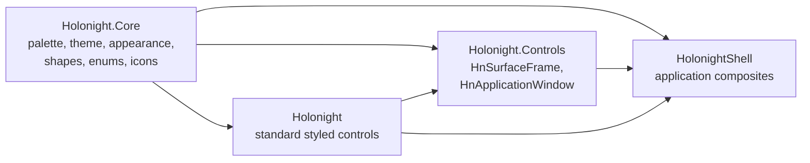

# Canonical HoloNight Module Adoption Design

**Project:** holonight-shell
**Date:** 2026-07-27
**Status:** Completed
**Requirements:** `docs/sdd/canonical-module-adoption/SPEC.md`
**Upstream baseline:** `holonight-qt` commit `25939dd`

## 1. Design Summary

The migration will make QML imports express the upstream ownership boundary directly:



Every affected QML file will import the smallest set of public modules that owns the types it
uses. The migration changes imports and directly supporting tests only; it does not qualify every
type reference, modify component bodies, or change rendering.

## 2. Repository Inventory

The Stage 2 inventory found:

| Area | Current state |
| --- | ---: |
| QML files importing a HoloNight namespace | 119 |
| Application QML files using a migrated Core type | 99 |
| Application QML files using `HnSurfaceFrame` | 4 |
| Application QML files using `HnApplicationWindow` | 0 |
| Test QML files using a migrated type | 17 |
| Lowercase `import holonight` uses | 0 |

The dominant use is `HoloniightPalette` (111 application/test QML files). Less frequent uses cover
`HolonightTheme`, `HnAppearance`, shape enums, `HnIconProvider`, `HnIcon`, and
`HnSurfaceFrame`.

No dynamically constructed QML import statement or lowercase Core/Controls module was found.
Runtime-created components load application QML by file URL or `qrc:/HolonightShell/` and will
inherit the imports declared by those files.

## 3. Import Classification

### 3.1 Core-only files

A file that uses only Core-owned migrated types will replace:

```qml
import Holonight
```

with:

```qml
import Holonight.Core
```

This is the expected classification for most shell QML, including palette-only visual
components, `HnIcon` consumers, shape consumers, and theme/appearance bridges.

### 3.2 Controls consumers

The following application files use `HnSurfaceFrame` and will import both canonical modules
required by their contents:

- `apps/shell/qml/Controls/HudFrame.qml`
- `apps/shell/qml/Popups/Network/WifiPasswordDialog.qml`
- `apps/shell/qml/Popups/Tooltip/TooltipPopup.qml`
- `apps/shell/qml/Popups/Tray/TrayMenuPopup.qml`

They will add `import Holonight.Controls` for `HnSurfaceFrame` and
`import Holonight.Core` for palette, surface-role, corner, and shape APIs. None currently uses a
style-owned type from `Holonight` directly, so the legacy import can be removed after the exact
type check during implementation.

The design applies the same rule to test files that instantiate or inspect `HnSurfaceFrame`.

### 3.3 Files retaining the style module

The following files directly instantiate standard controls exported by `Holonight` and will
retain that import while also adding `Holonight.Core` for migrated types:

| File | Style-owned types |
| --- | --- |
| `apps/settings/qml/AppearancePage.qml` | `ComboBox`, `Slider`, `Switch` |
| `apps/settings/qml/BarPage.qml` | `Slider` |
| `apps/settings/qml/FooterBar.qml` | `Button` |
| `apps/shell/qml/Launcher/LauncherRightPanelBrowse.qml` | `ScrollView` |

The implementation inventory will repeat this direct-type scan after editing so later changes in
the working tree are not missed.

`QtQuick.Controls as Controls` imports remain independent. A use such as
`Controls.ScrollView` is owned by that alias and is not, by itself, a reason to retain an unused
`import Holonight`.

### 3.4 Imports with no migrated-type use

Three current files import `Holonight` without using a migrated or directly exported style type:

- `apps/shell/qml/Notifications/ToastActionButton.qml`
- `apps/shell/qml/RightSidebar/SidebarContent.qml`
- `apps/shell/qml/Topbar/StatusesSection.qml`

Those imports will be removed after a final implementation-time check confirms that they do not
provide an implicit type. Their component bodies will not otherwise change.

### 3.5 `Holonight.Components`

`Holonight.Components` is a separate application/shared compatibility module used for
`ContentSeparator` and `ExternalIcon`. It is not part of upstream commit `25939dd` and remains
unchanged.

### 3.6 Aliases and ambiguity

No current `Holonight` import is aliased. Canonical imports will therefore remain unaliased unless
the implementation uncovers a concrete collision. Existing `QtQuick.Controls as Controls`
aliases are preserved.

## 4. Build and Runtime Design

### 4.1 Dependency discovery

The project already installs the complete sibling `holonight-qt` build into
`/tmp/holonight-qt-prefix` through `task build-deps`. That prefix contains:

- `Holonight/Core/libholonight_core_qml.so`, `qmldir`, qmltypes, and owned QML;
- `Holonight/Controls/libholonight_controls_qml.so`, `qmldir`, qmltypes, and owned QML;
- the existing `Holonight` compatibility/style module.

Existing test and lint paths already include `/tmp/holonight-qt-prefix/lib/qt6/qml`. The canonical
modules therefore need no copied sources, application-owned install rules, or new import path.

### 4.2 CMake targets

`HolonightQt::Core` and `HolonightQt::Controls` are upstream interface targets. The actual QML
plugins are dynamically loaded from the QML import path, and this repository deliberately sets
`QT_SKIP_AUTO_QML_PLUGIN_INCLUSION ON` because installed distro QML plugins may not expose linkable
plugin targets.

The implementation will not add ceremonial linkage that does not affect plugin discovery.
Instead:

- existing `find_package(HolonightQt REQUIRED)` remains unchanged;
- existing `HolonightQt::Config` and `HolonightQt::Theme` links remain unchanged;
- the canonical interface targets will be added only if configure/build evidence shows a target
  requires their transitive Qt usage requirements;
- runtime correctness is proven through direct canonical imports from the installed prefix.

This preserves the repository's dynamic-plugin architecture and the upstream CMake target names
without pretending that linking an interface target deploys a QML plugin.

### 4.3 Build-tree and installed execution

HoloNight Shell does not vendor or package the HoloNight Qt runtime; it consumes the installed
dependency. Therefore downstream install verification will check importability and required
artifacts in the configured dependency prefix rather than duplicate those artifacts in the shell
install tree.

CI already checks out and installs the upstream default branch before configuring the shell. The
pipeline will verify that the checked-out dependency contains the canonical module artifacts and
will add a clear guard only if current failures are otherwise opaque. It will not pin or rename the
upstream package in this cycle.

## 5. Test Design

### 5.1 Real canonical singletons

`FakeQmlServices` currently registers fake `HoloniightPalette` and `HolonightTheme` instances in
the legacy `Holonight` namespace. Migrated QML will import `Holonight.Core`, so the real upstream
Core plugin must own these singletons during tests.

The harness will:

- stop registering fake palette/theme instances under `Holonight`;
- retain shell-domain mocks under `HolonightShell`;
- isolate appearance/config reads through the existing temporary XDG configuration directory;
- use the installed Core plugin for palette, theme, appearance, shape, enum, and icon behavior.

Any fake classes made unused by this change will be removed only when their sole purpose was the
legacy registration. This is focused test-harness cleanup, not production refactoring.

### 5.2 Focused canonical contracts

Focused QML coverage will be updated or added to prove:

- `import Holonight.Core` resolves `HoloniightPalette`, `HolonightTheme`,
  `HnAppearance`, representative shape enums, `HnIconProvider`, and `HnIcon`;
- `import Holonight.Controls` instantiates `HnSurfaceFrame` and preserves content ownership,
  role, fill, border, and shape behavior already asserted downstream;
- `HnIcon` defaults, states, colors, and image-provider routing remain intact;
- Settings and representative shell components instantiate using canonical imports.

Existing tests will be migrated to the canonical module that owns the API they directly exercise.
Tests for standard styled controls will keep `import Holonight`.

### 5.3 Import guard

A small deterministic source scan will enforce application import ownership:

1. any file using a Core migrated name must import `Holonight.Core`;
2. any file using `HnSurfaceFrame` or `HnApplicationWindow` must import
   `Holonight.Controls`;
3. lowercase Core/Controls imports are forbidden;
4. `import Holonight` is permitted only when a file directly uses an exported style type or is
   listed with a concrete compatibility rationale.

The guard will use the upstream migrated-type and style-export lists recorded in the test rather
than attempting to parse arbitrary QML semantics. It will report the offending file and rule.

### 5.4 Dependency-prefix artifact check

A focused check will assert that the configured HoloNight Qt prefix contains the canonical Core
and Controls `qmldir`, plugin, and qmltypes artifacts before runtime smoke tests. The check will be
prefix-aware where the build already exposes a package location; it will not hard-code a second
install location beyond the repository's established development prefix.

Direct import/instantiation remains the authoritative functional check, because artifact presence
alone cannot prove a plugin loads.

## 6. Implementation Sequence

1. Add the deterministic import-ownership inventory/guard.
2. Migrate focused canonical Core and Controls tests.
3. Adjust `FakeQmlServices` so upstream Core owns canonical singletons.
4. Migrate application imports by ownership class.
5. Re-run the guard and inspect every retained compatibility/style import.
6. Add or refine dependency-prefix artifact verification if not already covered by canonical
   smoke loading.
7. Run narrow QML tests, lint, qmltypes validation, the full headless suite, and live launches.

This order makes the ownership rule executable before the bulk mechanical edit and lets focused
tests detect namespace or singleton conflicts early.

## 7. Verification Design

Verification will proceed as follows:

1. focused import-ownership guard;
2. focused `QmlSmoke` canonical import and representative component tests;
3. focused QtQuickTest cases for Core, icons, frames, theme, and component instantiation;
4. `task qml-lint`;
5. `task qmltypes-check` if CMake/QML registration changes;
6. dependency-prefix/install artifact check;
7. `task test`;
8. shell and Settings launches at `QT_SCALE_FACTOR=1.0` and `QT_SCALE_FACTOR=1.25`, with stderr
   captured and graceful termination so QML diagnostics flush;
9. retained-import audit, `git diff --check`, and final diff review.

The live check is diagnostic rather than a redesign review: it looks for import failures,
singleton conflicts, binding errors, component-creation errors, and obvious visual regression.

## 8. Trade-offs and Rejected Alternatives

### Blanket replacement of `import Holonight`

Rejected because files that instantiate standard styled controls still require the style module.
Per-file ownership classification is slightly more work but preserves the public module boundary.

### Keep `Holonight` everywhere and merely add canonical imports

Rejected because application code would continue depending unnecessarily on the compatibility
surface and ambiguous unqualified names could mask whether canonical imports actually work.

### Qualify every migrated type with an import alias

Rejected because there is no current collision and it would create a large, noisy behavioral
no-op diff. Unaliased canonical imports are the established upstream API.

### Link QML plugin implementation targets directly

Rejected because the installed package exposes `HolonightQt::Core` and
`HolonightQt::Controls` interface targets, while plugins are loaded dynamically. The repository's
`QT_SKIP_AUTO_QML_PLUGIN_INCLUSION` policy intentionally avoids assuming plugin CMake targets
exist on every supported system.

### Continue using fake legacy palette/theme registrations

Rejected because those fakes would not validate canonical singleton loading or identity and could
hide missing Core plugin artifacts.

## 9. Requirement Traceability

| Requirement | Design coverage |
| --- | --- |
| REQ-F-001 | Sections 2, 3, 5.3 |
| REQ-F-002 | Sections 3.1, 3.6 |
| REQ-F-003 | Section 3.2 |
| REQ-F-004 | Sections 3.3, 3.4 |
| REQ-F-005 | Sections 5.1, 5.2 |
| REQ-F-006 | Sections 1, 5.2, 7 |
| REQ-F-007 | Section 4.2 |
| REQ-F-008 | Sections 4.1, 4.3 |
| REQ-F-009 | Sections 5.2, 5.3 |
| REQ-F-010 | Sections 4.3, 5.4 |
| REQ-F-011 | Section 7 |
| REQ-F-012 | Sections 3.3, 3.4, 7 |
| REQ-NF-001 | Sections 1, 6, 8 |
| REQ-NF-002 | Sections 1, 4, 8 |
| REQ-NF-003 | Sections 5, 7 |
| REQ-NF-004 | Section 7 |
| REQ-NF-005 | Sections 6, 7 |

## 10. Pipeline Status

- Requirements: approved
- Design: approved
- Task breakdown: approved
- Implementation: completed
- Pipeline closure: approved on 2026-07-28
